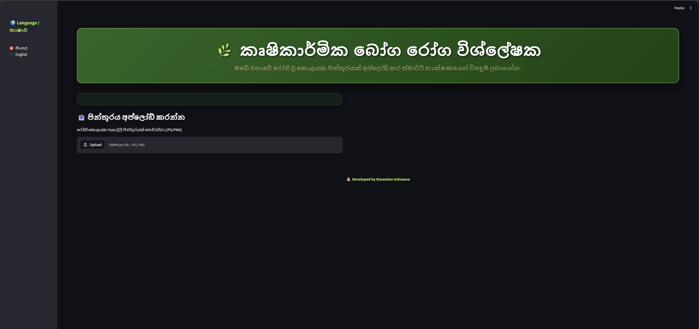
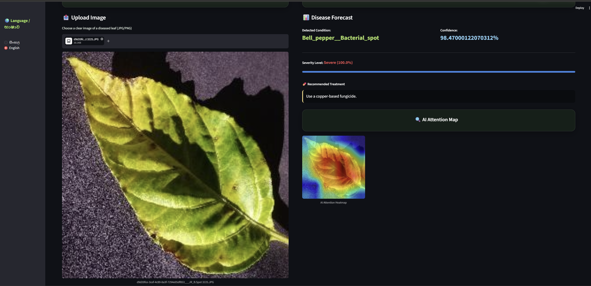

# 🌱 Smart Crop Disease Analyzer v3.3


An advanced, interactive, and bilingual (Sinhala & English) web application built to detect agricultural crop diseases from leaf images. This project leverages Deep Learning (TensorFlow/Keras) to identify diseases and recommend treatments, all wrapped in a stunning, nature-inspired **Glassmorphism UI** with a dynamic video background.

## ✨ Key Features

* 🔍 **High-Accuracy Disease Detection:** Identifies multiple crop diseases (Tomato, Potato, Bell Pepper, etc.) using a custom-trained Deep Learning model.
* 🧠 **Explainable AI (Grad-CAM):** Generates an AI Attention Heatmap to show exactly *where* the model is looking on the leaf to make its prediction.
* 🌍 **Bilingual Support:** Seamlessly switch between **English** and **Sinhala (සිංහල)** interfaces.
* 🎨 **Next-Gen UI/UX:** Features a modern Glassmorphism design, transparent elements, and a looping nature video background for a premium user experience.
* 📊 **Risk Assessment:** Calculates a severity score based on the affected area of the leaf.
* 💊 **Treatment Recommendations:** Provides actionable agricultural advice for detected pathogens.

## 📸 Screenshots

*(Add your screenshots here! Replace the placeholder links with actual image links after you upload them to your repo)*

| Upload Interface | Disease Analysis & Heatmap |
| :---: | :---: |
|  |  |

## 🛠️ Technology Stack

* **Frontend:** Streamlit, HTML/CSS (Custom Glassmorphism)
* **Machine Learning:** TensorFlow, Keras
* **Computer Vision:** OpenCV, NumPy, Pillow (PIL)
* **Deployment:** Local / Streamlit Cloud

## 🚀 How to Run Locally

Follow these steps to run the application on your own machine.

### 1. Clone the Repository
```bash
git clone [https://github.com/YourUsername/Your-Repo-Name.git](https://github.com/YourUsername/Your-Repo-Name.git)
cd Kavi-Cs

pip install streamlit tensorflow opencv-python-headless pillow numpy

streamlit run app.py

├── app_V2.py                        # Main Streamlit application file
├── super_crop_disease_model.keras   # Trained Deep Learning model
├── bg_video.mp4                     # Background video 
├── requirements.txt                 # Python dependencies
└── README.md                        # Project documentation
